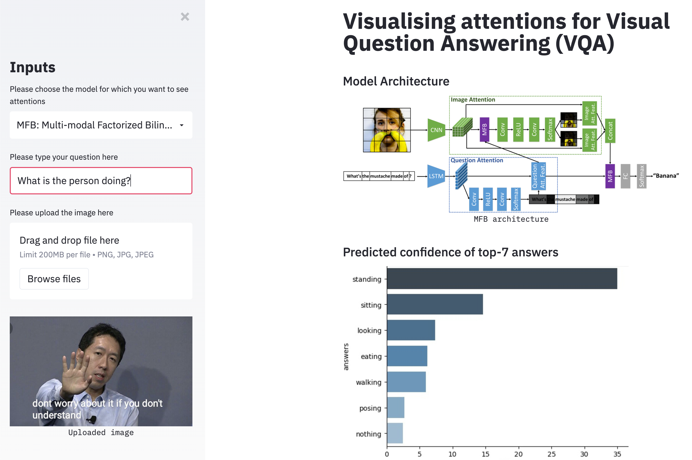
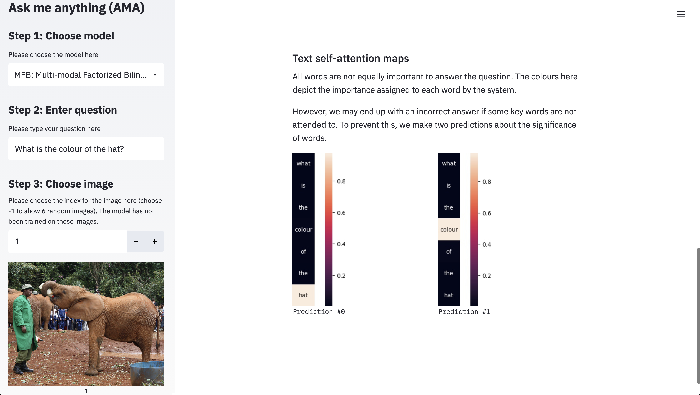

# Ask Me Anything: A tool for visualising Visual Question Answering (AMA) [](https://share.streamlit.io/apugoneappu/ask_me_anything/main.py)
An easy-to-use app to visualise attentions of various VQA models. __Please click [here](https://share.streamlit.io/apugoneappu/ama/main.py) to see a live demo of the app!__   



• [Models](#models)  
• [Requirements](#requirements)  
• [Installation](#installation)  
• [How to run](#how-to-run)  
• [How to use](#how-to-use)  
• [Contributing](#contributing)  
• [Acknowledgements](#acknowledgements)  

## Models

• MFB - Multi-modal Factorized Bilinear Pooling with Co-Attention Learning for Visual Question Answering  
_Zhou Yu, Jun Yu, Jianping Fan, Dacheng Tao_  
[Arxiv](https://arxiv.org/abs/1708.01471)  

• (Coming soon) MCAN - Deep Modular Co-Attention Networks for Visual Question Answering   
_Zhou Yu, Jun Yu, Yuhao Cui, Dacheng Tao, Qi Tian_  
[Arvix](https://arxiv.org/abs/1906.10770)  

## Requirements
Please check the [requirements.txt](https://github.com/apugoneappu/ask_me_anything/blob/master/requirements.txt) file for the version numbers.

1. opencv_python==4.4.0.46
2. numpy==1.19.4
3. pandas==1.1.4
4. torch==1.4.0
5. matplotlib==3.3.2
6. gdown==3.12.2
7. seaborn==0.11.0
8. dotmap==1.3.23
9. streamlit==0.70.0
10. Pillow==8.0.1
11. PyYAML==5.3.1

## Installation
1. Install Anaconda 
2. Clone this repository and cd into it.  
```git clone https://github.com/apugoneappu/ask_me_anything.git && cd ask_me_anything```
3. In a new environment (`new_env`)  
```pip install -r requirements.txt```  

## How to run
From the directory of this repository, do the following -

1. ```conda activate new_env```
2. ```streamlit run main.py```
3. In a browser tab, open the Network URL displayed in your terminal.

Done! 🎉

## How to use




## Contributing

First of all, thank you for wanting to contribute to this work! I will try and make your job as easy as possible. Detailed instructions coming soon ...

## Acknowledgements 
This repository has been built by modifying the [OpenVQA repository](https://github.com/MILVLG/openvqa/). 

I would also like to thank [Yash Khandelwal](https://github.com/yash12khandelwal), [Nikhil Shah](https://github.com/itsshnik) and [Chinmay Singh](https://github.com/chinmay-singh) for their support and amazing suggestions!

Huge thanks to Streamlit for making all of this possible and for Streamlit Sharing that enables free hosting of this app! ❤️  

